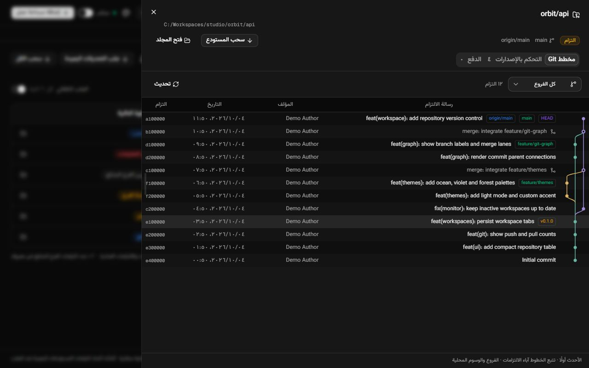
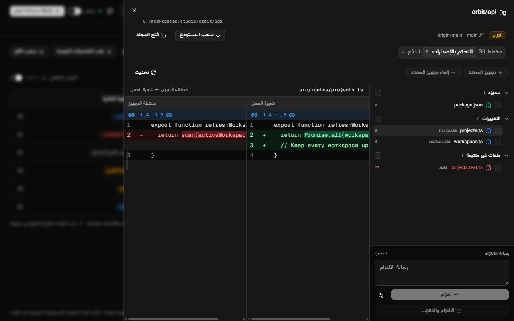
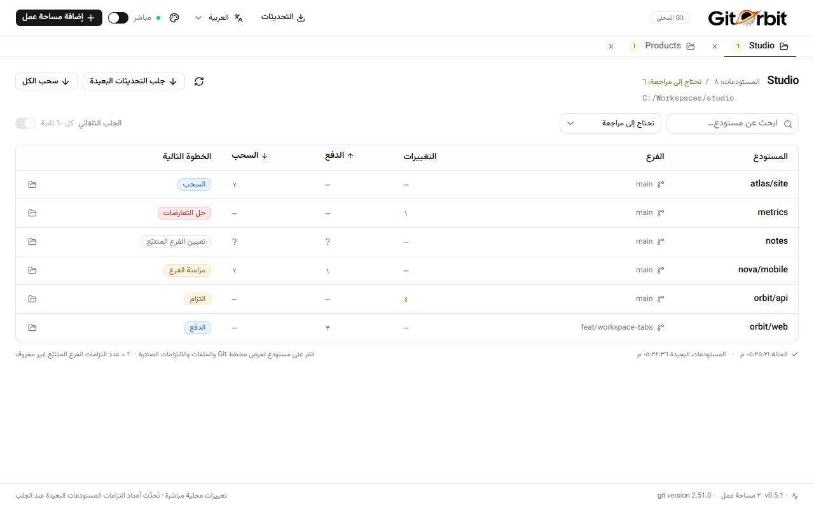
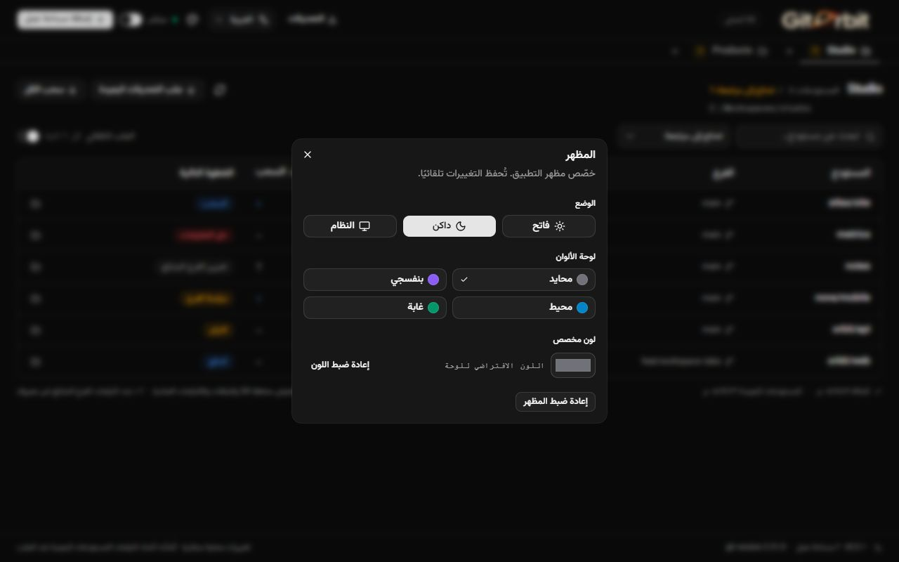

<p align="center"><a href="README.md">English</a> · <a href="README.fa.md">فارسی</a> · <strong>العربية</strong> · <a href="README.zh-CN.md">简体中文</a></p>

<div align="center">
  
  <h1>GitOrbit</h1>
  <p><strong>اعرف بنظرة واحدة أي مشروع يحتاج إلى التزام أو دفع أو سحب.</strong></p>
  <p>تطبيق مكتبي صغير لمراقبة Git في عدة مساحات عمل، مبني باستخدام Tauri وReact وshadcn/ui.</p>
  <p><a href="https://github.com/sajadjanat/gitorbit/releases/latest">تنزيل أحدث إصدار</a> · <a href="https://github.com/sajadjanat/gitorbit/issues">الإبلاغ عن مشكلة أو اقتراح</a></p>
</div>

<div dir="rtl">


*التُقطت الصور من واجهة التطبيق الفعلية ببيانات تجريبية. تحتفظ أسماء المستودعات والمسارات والشيفرة ورسائل Git التجريبية بمحتواها الأصلي.*

## لماذا GitOrbit؟

عندما تتوزع المشاريع على عدة مجلدات، يستغرق فحص كل مستودع وقتًا. يجمع GitOrbit التغييرات المحلية والالتزامات المتقدمة أو المتأخرة والخطوة التالية في جدول واحد. افتح عدة مساحات عمل كتَبويبات؛ تواصل التبويبات الأخرى المراقبة في الخلفية. يُبقي مرشّح «تحتاج إلى مراجعة» العرض اليومي مختصرًا، بينما يعرض «كل المستودعات» المشاريع التي لا تحتاج إلى تغيير أيضًا.

## الميزات

| الميزة | وظيفتها |
| --- | --- |
| تبويبات مساحات العمل | إضافة عدة مجلدات والتنقل بينها واستعادتها عند فتح التطبيق مجددًا. |
| حالة محلية مباشرة | تحديث بعد تغيّر الملفات، مع فحص دوري لاستدراك الأحداث الفائتة. |
| الخطوة التالية | شارات ملونة للالتزام والدفع والسحب وحل التعارضات ومزامنة الفرع وضبط الفرع المتتبّع. |
| مخطط Git | سجل حقيقي للالتزامات ومسارات الفروع والدمج وHEAD والوسوم. |
| التحكم بالإصدارات | الملفات المجهّزة والتغييرات والملفات غير المتتبّعة، مقارنة جانبية وتجهيز وإلغاء تجهيز والتزام. |
| معاينة الدفع | مراجعة الالتزامات الصادرة وفروق الملفات في عمودين متزامنين قبل الدفع. |
| سحب مستودع أو الكل | تحديث بالتقديم السريع مع نتيجة مستقلة لكل مشروع. |
| مظهر قابل للتخصيص | فاتح أو داكن أو حسب النظام؛ لوحات محايدة وبنفسجية ومحيط وغابة ولون مخصص. |
| أربع لغات | الإنجليزية والفارسية والعربية والصينية المبسطة، مع حفظ الاختيار ودعم RTL/LTR. |
| تحديث داخل التطبيق | البحث عن إصدارات موقّعة وتثبيتها من «تحديث وإعادة التشغيل». |
| إعداد Git | اكتشاف Git واقتراح مثبّت النظام أو صفحة التنزيل الرسمية. |

## معاينات

### الفروع والدمج



### الملفات والفروق والالتزام



### الوضع الفاتح وإعدادات المظهر





## التنزيل والتثبيت

اختر حزمة نظامك من [أحدث إصدار](https://github.com/sajadjanat/gitorbit/releases/latest):

| النظام | الحزمة |
| --- | --- |
| Windows x64 | مثبّت `x64-setup.exe` أو ZIP محمول. استخرج الحزمة المحمولة كاملة وأبقِ `WebView2Loader.dll` بجانب الملف التنفيذي. |
| macOS | DMG شامل لأجهزة Intel وApple Silicon؛ انسخ التطبيق إلى Applications. |
| Linux x64 | AppImage أو DEB؛ تستبدل حزمة DEB حزمة `workspace-monitor` القديمة عند الترقية. |

لا تحتاج إلى Node.js أو Rust لتشغيل الحزمة الجاهزة. Git مطلوب للمراقبة ويساعدك التطبيق على تثبيته. يمكن لمثبّت Windows توفير WebView2 إن كان مفقودًا. توقيع تحديثات التطبيق مفعّل؛ توقيع نظام التشغيل وتوثيق macOS ‏(notarization) غير معدّين بعد.

## البدء السريع

1. افتح التطبيق. إذا لم يكن Git مثبتًا، اختر «تثبيت Git» أو «تنزيل Git» ثم «تحقق مجددًا».
2. اختر «العربية» من قائمة اللغة في الأعلى. يُحفظ الاختيار؛ تغيير اللغة لا يمحو التبويبات أو الملفات المحددة أو مسودة رسالة الالتزام.
3. اختر «إضافة مساحة عمل» وحدّد مجلد مشاريعك. يمكنك اختيار عدة مجلدات معًا.
4. اقرأ «الخطوة التالية». انقر على مستودع وانتقل بين «مخطط Git» و«التحكم بالإصدارات» و«الدفع».
5. اختر «جلب التحديثات البعيدة» للحصول على أعداد حديثة، أو فعّل الجلب التلقائي.
6. اختر «سحب الكل» أو «سحب المستودع» وراجع النتائج. استخدم «المظهر» لاختيار الوضع واللون.

| العمود | المعنى |
| --- | --- |
| التغييرات | إدخالات Git المتغيرة: المجهّزة وغير المجهّزة وغير المتتبّعة. |
| الدفع | الالتزامات المتقدمة على الفرع المتتبّع. |
| السحب | الالتزامات المتأخرة عن الفرع المتتبّع. |
| — | لا تغييرات أو لا التزامات. |
| ? | لا يوجد عدد موثوق للفرع المتتبّع؛ راجع تفاصيل المستودع. |

## الملفات وعمليات Git

يظهر الملف المجهّز جزئيًا في مجموعتي «المجهّزة» و«التغييرات». انقر عليه لمقارنة HEAD بمنطقة التجهيز أو منطقة التجهيز بمجلد العمل. حدّد مربعات الاختيار ثم اختر «تجهيز المحدد» أو «إلغاء تجهيز المحدد». يسجّل الالتزام منطقة التجهيز الحالية فقط؛ لا تُضاف الملفات غير المجهّزة تلقائيًا. تبقى خطافات Git وإعدادات التوقيع الخاصة بك سارية.

يشمل «سحب الكل» المستودعات المخفية بالبحث أو التصفية. يستخدم السحب `git pull --ff-only --no-rebase --no-edit`. تُتجاوز المستودعات ذات التغييرات المحلية أو HEAD المنفصل أو دون فرع متتبّع؛ يفشل السجل المتشعب دون دمج أو إعادة تأسيس. لا يخزّن التطبيق تغييراتك مؤقتًا أو يحذفها تلقائيًا، ولا يدفع بالقوة.

راجع الالتزامات والملفات في تبويب «الدفع» قبل الإرسال. تُرسل الالتزامات التي عاينتها إلى الفرع البعيد المتتبّع؛ تبقى التغييرات غير الملتزم بها على الجهاز. إذا تغيّر الفرع بعد المعاينة، حدّث القائمة أولًا.

يفحص التطبيق وجهة الدفع الفعلية قبل الإرسال. عند وجود عمل جديد بعيدًا، تظهر «مزامنة قبل الدفع»: اختر «الجلب والتحقق» لمراجعة الالتزامات الواردة، ثم اسحبها إذا كان الفرع متأخرًا فقط أو ادمجها إذا أضاف الطرفان التزامات. راجع معاينة الدفع الجديدة ثم ادفع صراحةً. تُحفظ معرّفات الالتزامات؛ تمنع تغييرات الملفات غير الملتزم بها المزامنة. عند تعارض الدمج، افتح التحكم بالإصدارات لحل الملفات وتجهيزها والالتزام بالدمج، أو ألغِ الدمج بعد قراءة تحذير فقد تعديلات حل التعارض. تظهر إرشادات للعمليات الجارية ووجهات الجلب والدفع المختلفة. يتيح فشل مصادقة الجلب تسجيل الدخول وإعادة الجلب صراحةً.

انقر على ملف لمقارنة الالتزام بوالده الأول في عمودين مع تمرير متزامن. تنتقل قائمة الملفات إلى موضع قائمة الالتزامات؛ أغلق المعاينة للعودة إلى الالتزامات الصادرة. لا تدخل التغييرات المحلية غير الملتزم بها في هذه المقارنة.

عند فشل مصادقة الدفع، تظهر رسالة تسجيل الدخول وزر «تسجيل الدخول إلى Git». أكمل الدخول في نافذة Git Credential Manager، ثم أعد محاولة الدفع. تُفحص صلاحية الدخول باستخدام dry-run دون إرسال الالتزامات. يمكن إلغاء الدخول، ويتوقف بعد ثلاث دقائق. إذا لم تكن الأداة مثبتة أو مهيأة، يفتح زر الإعداد [الدليل الرسمي](https://github.com/git-ecosystem/git-credential-manager/blob/main/docs/install.md)؛ ثبّتها وهيّئها ثم أعد الفحص. استخدم رمز وصول إذا طلبه الخادم. تحتاج اتصالات SSH إلى إعداد المفتاح خارج التطبيق. لا يستقبل GitOrbit كلمة مرورك، ولا تفتح المراقبة الخلفية نوافذ الدخول.

يعتمد المخطط على آباء الالتزامات الحقيقيين. يبدأ السجل بـ٢٠٠ التزام ويمكن زيادته إلى ٥٠٠٠؛ يعرض النسخ الضحل السجل المتاح محليًا فقط. تبقى المسارات والتجزئات والشيفرة مقروءة مستقلّة عن RTL، وتُعرض تواريخ الالتزامات بالتنسيق المحلي والتقويم الميلادي.

تُحدّث التغييرات المحلية بعد ٧٥٠ ملّي ثانية من توقف الأحداث، وبحد أقصى مرة كل ٣ ثوانٍ، مع فحص احتياطي كل ٦٠ ثانية. الجلب التلقائي اختياري ويعمل تقريبًا كل ٦٠ ثانية. عند إيقاف المراقبة المباشرة يبقى التحديث والجلب اليدويان متاحين.

## التحديثات والإعدادات

بدءًا من ٠.٣.٠، يفحص التطبيق الإصدارات عند التشغيل وكل ست ساعات. يمكنك الفحص يدويًا من زر التحديثات في الأعلى. لا تُقبل إلا الحزم الموقّعة بالمفتاح الأصلي. ينتظر التثبيت انتهاء عمليات Git ويحفظ إعداداتك. إذا منع الوكيل التنزيل، اختر «اتصال مباشر» ضمن «اتصال التحديث».

أصبح Workspace Monitor الآن GitOrbit. يمكن للإصدارات ٠.٣.٠–٠.٣.٢ الترقية داخل التطبيق؛ يحتاج مستخدمو ٠.١.٠ و٠.٢.٠ إلى تثبيت أحدث إصدار يدويًا مرة واحدة. تتحول نسخة Windows المحمولة عند التحديث إلى تثبيت عادي للمستخدم نفسه.

تُحفظ مساحات العمل في `workspaces.json` داخل دليل إعدادات `ir.sepehra.workspace-monitor`. تُحفظ اللغة والمظهر في التخزين المحلي للتطبيق. إغلاق تبويب لا يحذف مجلد المشروع. يحدّد Git الملفات المتجاهلة؛ ملف `.idea` المتتبّع مسبقًا لا يُزال تلقائيًا بإضافته إلى `.gitignore`.

## التطوير والمساهمة

ثبّت Node.js ‏٢٢ أو أحدث وRust stable وGit و[متطلبات Tauri](https://tauri.app/start/prerequisites/).

</div>

```sh
git clone https://github.com/sajadjanat/gitorbit.git
cd gitorbit
npm ci
npm run tauri dev

# Checks
npm test
npm run build
cargo test --locked --manifest-path src-tauri/Cargo.toml

# Package
npm run tauri build
```

<div dir="rtl">

للمعاينة التجريبية شغّل `npm run docs:preview` و`npm run dev` وافتح `http://localhost:1420/.dev/readme-preview.html?lang=ar`. هذه صفحة للمستندات فقط؛ يقرأ التطبيق المثبّت حالة Git الحقيقية.

راجع [دليل التطوير](docs/development.md) و[README الإنجليزي](README.md) لتفاصيل البنية والاختبارات والنشر. أضف نصوص الواجهة الجديدة لجميع اللغات في `src/lib/messages.ts` مع الحفاظ على حقول الاستبدال نفسها. [أبلغ عن مشكلة أو اقترح ميزة](https://github.com/sajadjanat/gitorbit/issues).

من تطوير [Sajad Janat](https://github.com/sajadjanat)، باستخدام [shadcn/ui](https://ui.shadcn.com/) و[Tauri](https://tauri.app/).

</div>

