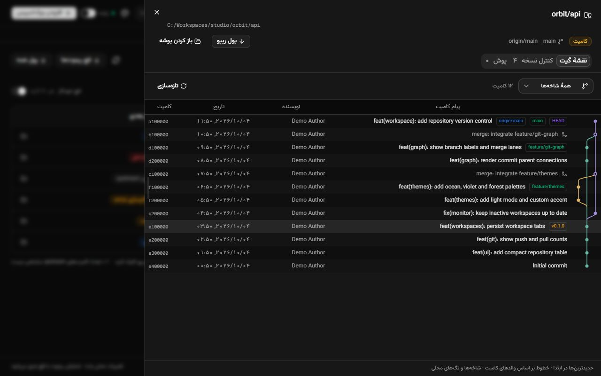
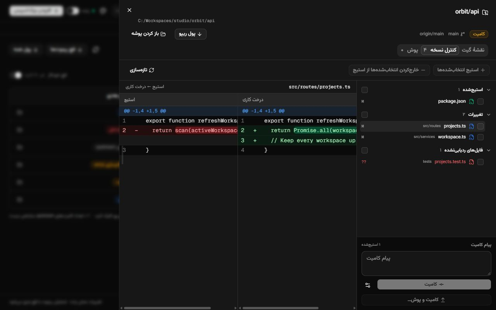
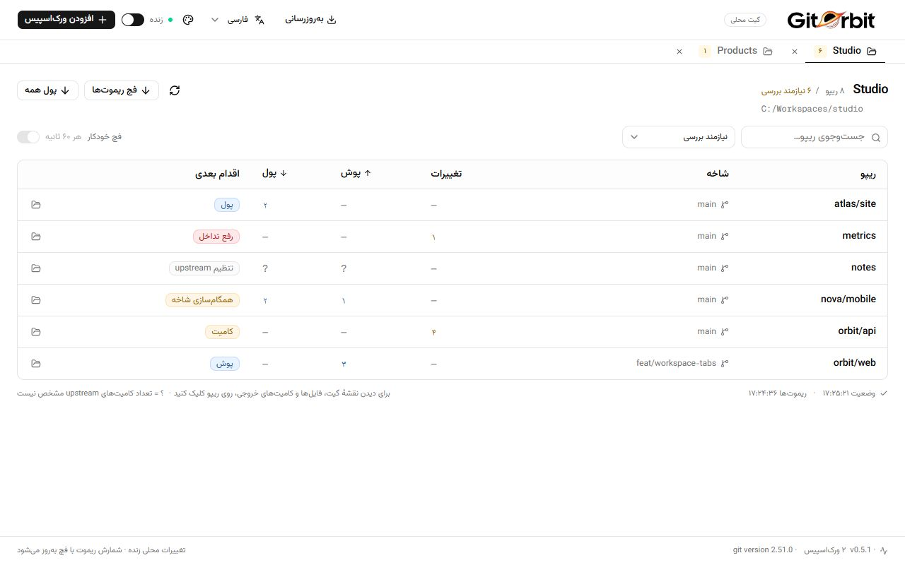
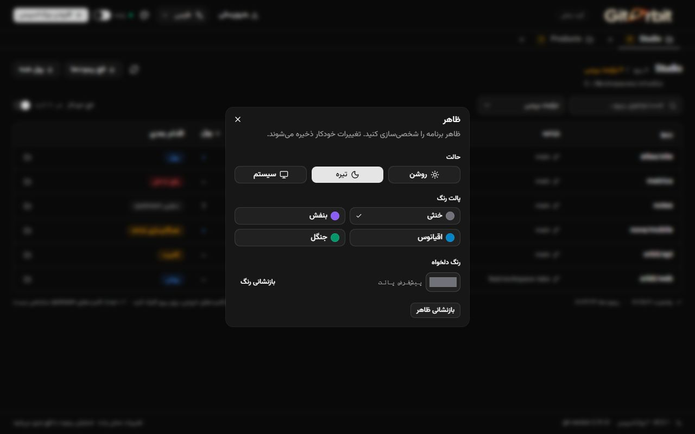

<p align="center"><a href="README.md">English</a> · <strong>فارسی</strong> · <a href="README.ar.md">العربية</a> · <a href="README.zh-CN.md">简体中文</a></p>

<div align="center">
  
  <h1>GitOrbit</h1>
  <p><strong>در یک نگاه ببینید کدام پروژه نیاز به کامیت، پوش یا پول دارد.</strong></p>
  <p>پایش گیت در چند ورک‌اسپیس؛ یک اپ دسکتاپ جمع‌وجور با Tauri، React و shadcn/ui.</p>
  <p><a href="https://github.com/sajadjanat/gitorbit/releases/latest">دانلود آخرین نسخه</a> · <a href="https://github.com/sajadjanat/gitorbit/issues">گزارش مشکل یا پیشنهاد</a></p>
</div>

<div dir="rtl">


*تصاویر از رابط واقعی اپ با داده‌های نمونه گرفته شده‌اند. نام ریپوها، مسیرها، کد و پیام‌های نمونهٔ گیت، محتوای اصلی خود را حفظ می‌کنند.*

## چرا GitOrbit؟

وقتی پروژه‌ها در چند پوشه هستند، بررسی جداگانهٔ وضعیت گیت وقت می‌گیرد. GitOrbit تغییرات محلی، کامیت‌های جلوتر یا عقب‌تر از ریموت و اقدام بعدی را در یک جدول نشان می‌دهد. چند ورک‌اسپیس را به شکل تب باز کنید؛ تب‌های دیگر هم در پس‌زمینه پایش می‌شوند. فیلتر «نیازمند بررسی» نمایش روزانه را کوتاه نگه می‌دارد و «همهٔ ریپوها» پروژه‌های بدون تغییر را هم نشان می‌دهد.

## امکانات

| قابلیت | کاربرد |
| --- | --- |
| تب‌های ورک‌اسپیس | افزودن چند پوشه، جابه‌جایی بین آن‌ها و بازیابی تب‌ها هنگام اجرای دوبارهٔ اپ. |
| وضعیت زنده | تازه‌سازی پس از تغییر فایل‌ها، همراه با اسکن دوره‌ای برای تغییرات ازدست‌رفته. |
| اقدام بعدی | برچسب رنگی برای کامیت، پوش، پول، رفع تداخل، همگام‌سازی شاخه و تنظیم upstream. |
| نقشهٔ گیت | تاریخچهٔ واقعی کامیت‌ها، مسیر شاخه‌ها، ادغام‌ها، HEAD و تگ‌ها. |
| کنترل نسخه | فایل‌های استیج‌شده، تغییرات و فایل‌های ردیابی‌نشده؛ تفاوت کنار هم، استیج، خارج‌کردن از استیج و کامیت. |
| پیش‌نمایش پوش | بررسی کامیت‌های خروجی و دیف دو‌ستونهٔ هماهنگ فایل‌های هر کامیت پیش از پوش. |
| پول یک یا همهٔ ریپوها | به‌روزرسانی با fast-forward و نمایش نتیجهٔ جداگانهٔ هر پروژه. |
| ظاهر دلخواه | تم روشن، تاریک یا سیستم؛ رنگ‌های خنثی، بنفش، اقیانوس و جنگل؛ رنگ تأکیدی دلخواه. |
| چهار زبان | انگلیسی، فارسی، عربی و چینی ساده‌شده؛ ذخیرهٔ زبان و چیدمان RTL/LTR. |
| آپدیت داخل اپ | بررسی نسخهٔ امضاشده و نصب از «به‌روزرسانی و راه‌اندازی مجدد». |
| راهنمای نصب گیت | تشخیص گیت و پیشنهاد نصب‌کنندهٔ سیستم یا صفحهٔ رسمی دانلود. |

## پیش‌نمایش‌ها

### شاخه‌ها و ادغام‌ها



### فایل‌ها، تفاوت‌ها و کامیت



### تم روشن و تنظیمات ظاهر





## دانلود و نصب

از [آخرین ریلیز](https://github.com/sajadjanat/gitorbit/releases/latest) بستهٔ مناسب سیستم خود را بگیرید:

| سیستم‌عامل | بسته |
| --- | --- |
| ویندوز x64 | نصب‌کنندهٔ `x64-setup.exe` یا فایل ZIP پرتابل. نسخهٔ پرتابل را کامل استخراج کنید و `WebView2Loader.dll` را کنار فایل اجرایی نگه دارید. |
| مک | DMG یونیورسال برای Intel و Apple Silicon؛ اپ را به Applications منتقل کنید. |
| لینوکس x64 | AppImage یا DEB؛ بستهٔ DEB هنگام ارتقا جایگزین بستهٔ قدیمی `workspace-monitor` می‌شود. |

برای اجرای بستهٔ آماده نیازی به Node.js یا Rust نیست. گیت لازم است و اپ برای نصب آن راهنمایی می‌کند. نصب‌کنندهٔ ویندوز می‌تواند WebView2 را در صورت نبودن نصب کند. امضای آپدیت فعال است؛ امضای سیستم‌عامل و notarization مک هنوز تنظیم نشده‌اند.

## شروع سریع

1. اپ را باز کنید. اگر گیت نصب نیست، «نصب گیت» یا «دانلود گیت» و سپس «بررسی دوباره» را بزنید.
2. از منوی زبان بالای اپ «فارسی» را انتخاب کنید. انتخاب ذخیره می‌شود؛ تغییر زبان تب‌ها، فایل‌های انتخاب‌شده و پیش‌نویس کامیت را پاک نمی‌کند.
3. «افزودن ورک‌اسپیس» را بزنید و پوشهٔ پروژه‌ها را انتخاب کنید؛ انتخاب چند پوشه هم ممکن است.
4. ستون «اقدام بعدی» را ببینید. روی ریپو کلیک کنید و بین «نقشهٔ گیت»، «کنترل نسخه» و «پوش» جابه‌جا شوید.
5. برای شمارش تازهٔ کامیت‌های ریموت، «فچ ریموت‌ها» را بزنید یا فچ خودکار را فعال کنید.
6. برای به‌روزرسانی، «پول همه» یا «پول ریپو» را بزنید و نتیجه‌ها را بررسی کنید. از «ظاهر» هم تم و رنگ را تغییر دهید.

| ستون | معنی |
| --- | --- |
| تغییرات | ورودی‌های تغییرکردهٔ گیت؛ استیج‌شده، استیج‌نشده و ردیابی‌نشده. |
| پوش | تعداد کامیت‌های جلوتر از upstream. |
| پول | تعداد کامیت‌های عقب‌تر از upstream. |
| — | صفر تغییر یا صفر کامیت. |
| ? | تعداد قابل اتکایی برای upstream در دسترس نیست؛ جزئیات ریپو را بررسی کنید. |

## فایل‌ها و عملیات گیت

فایل نیمه‌استیج‌شده در هر دو گروه «استیج‌شده» و «تغییرات» دیده می‌شود. روی فایل کلیک کنید تا تفاوت HEAD با استیج یا استیج با درخت کاری را ببینید. چک‌باکس‌ها را انتخاب کنید و «استیج انتخاب‌شده‌ها» یا «خارج‌کردن انتخاب‌شده‌ها از استیج» را بزنید. کامیت فقط محتوای فعلی استیج را ثبت می‌کند؛ فایل‌های استیج‌نشده خودکار اضافه نمی‌شوند. هوک‌ها و تنظیمات امضای گیت حفظ می‌شوند.

«پول همه» حتی ریپوهای پنهان‌شده با فیلتر یا جست‌وجو را بررسی می‌کند. پول با `git pull --ff-only --no-rebase --no-edit` انجام می‌شود. ریپوهای دارای تغییر محلی، HEAD جداشده یا بدون upstream رد می‌شوند؛ تاریخچهٔ واگرا بدون ادغام یا rebase خطا می‌دهد. اپ تغییرات را خودکار استش یا حذف نمی‌کند و force-push ندارد.

پیش از پوش، کامیت‌ها و فایل‌های خروجی را در تب «پوش» بررسی کنید. فقط کامیت‌های بررسی‌شده به شاخهٔ ریموتِ متتبّع فرستاده می‌شوند؛ تغییرات کامیت‌نشده روی سیستم می‌مانند. اگر شاخه پس از پیش‌نمایش عوض شود، فهرست را تازه‌سازی کنید.

اپ پیش از ارسال، مقصد واقعی پوش را برای تغییرات جدید بررسی می‌کند. خطای عقب‌بودن شاخه، بخش «همگام‌سازی پیش از پوش» را باز می‌کند: «فچ و بررسی» کامیت‌های ورودی را نشان می‌دهد؛ اگر فقط عقب هستید، آن‌ها را پول کنید و اگر هر دو طرف کامیت دارند، «ادغام کامیت‌های ورودی» را بزنید. سپس پیش‌نمایش تازهٔ پوش را بررسی کنید و خودتان پوش بزنید. شناسهٔ کامیت‌های موجود حفظ می‌شود و تغییرات کامیت‌نشده مانع همگام‌سازی‌اند. در تعارض، Version Control را برای رفع، اد کردن و کامیت ادغام باز کنید یا بعد از خواندن هشدارِ حذف ویرایش‌های رفع تعارض، ادغام را لغو کنید. عملیات دیگر گیت و مقصدهای متفاوت فچ و پوش، راهنمای اقدام دارند. اگر فچ نیاز به احراز هویت داشته باشد، ورود و تلاش مجدد برای فچ در دسترس است.

روی فایل کلیک کنید تا دیف دو‌ستونهٔ کامیت و والد اول آن نمایش داده شود. لیست فایل‌ها جای لیست کامیت‌ها را می‌گیرد؛ با بستن دیف، دوباره کامیت‌های خروجی را می‌بینید. اسکرول دو ستون هماهنگ است و تغییرات فعلیِ کامیت‌نشده وارد این مقایسه نمی‌شوند.

در خطای احراز هویت پوش، پیام «نیاز به ورود به گیت» و دکمه «ورود به گیت» نمایش داده می‌شود. ورود را در پنجره Git Credential Manager انجام دهید و سپس «تلاش مجدد برای پوش» را بزنید. بررسی ورود با dry-run است و کامیت‌ها را ارسال نمی‌کند. ورود قابل لغو است و پس از سه دقیقه متوقف می‌شود. اگر ابزار ورود نصب یا تنظیم نشده باشد، دکمه راه‌اندازی، [راهنمای رسمی](https://github.com/git-ecosystem/git-credential-manager/blob/main/docs/install.md) را باز می‌کند؛ پس از نصب و تنظیم، دوباره بررسی کنید. در صورت نیاز سرور از توکن دسترسی استفاده کنید. برای ریموت SSH، کلید را بیرون اپ تنظیم کنید. اپ رمز شما را دریافت نمی‌کند و پایش پس‌زمینه پنجره ورود باز نمی‌کند.

نقشه از والدهای واقعی کامیت‌ها ساخته می‌شود. تاریخچه ابتدا ۲۰۰ کامیت دارد و تا ۵۰۰۰ قابل افزایش است؛ shallow clone فقط تاریخچهٔ محلی را نشان می‌دهد. مسیرها، هش‌ها و کد مستقل از RTL خوانا می‌مانند؛ تاریخ کامیت با اعداد محلی و تقویم میلادی نمایش داده می‌شود.

تغییرات محلی پس از ۷۵۰ میلی‌ثانیه سکوت رویدادها، حداکثر هر ۳ ثانیه تازه می‌شوند و هر ۶۰ ثانیه اسکن پشتیبان انجام می‌شود. فچ خودکار اختیاری تقریباً هر ۶۰ ثانیه است. با توقف پایش زنده، تازه‌سازی و فچ دستی همچنان قابل استفاده‌اند.

## آپدیت و تنظیمات

از نسخهٔ ۰.۳.۰، اپ هنگام اجرا و هر شش ساعت نسخهٔ جدید را بررسی می‌کند. از دکمهٔ به‌روزرسانی بالای اپ هم می‌توان دستی بررسی کرد. فقط بستهٔ امضاشده با کلید اصلی پذیرفته می‌شود؛ نصب تا پایان عملیات گیت صبر می‌کند و تنظیمات ذخیره‌شده را نگه می‌دارد. اگر پراکسی مانع دانلود است، در «اتصال به‌روزرسانی» گزینهٔ «اتصال مستقیم» را انتخاب کنید.

Workspace Monitor اکنون GitOrbit است. نسخه‌های ۰.۳.۰ تا ۰.۳.۲ از داخل اپ ارتقا می‌یابند؛ نسخه‌های ۰.۱.۰ و ۰.۲.۰ یک بار نصب دستی آخرین نسخه را لازم دارند. نصب پرتابل ویندوز هنگام آپدیت به نصب عادی برای همان کاربر تبدیل می‌شود.

ورک‌اسپیس‌ها در `workspaces.json` زیر پوشهٔ تنظیمات `ir.sepehra.workspace-monitor` ذخیره می‌شوند. زبان و ظاهر در حافظهٔ محلی اپ ذخیره می‌شوند. بستن تب پوشهٔ پروژه را حذف نمی‌کند. گیت خودش فایل‌های نادیده‌گرفته‌شده را تعیین می‌کند؛ فایل `.idea` که از قبل track شده باشد با افزودن `.gitignore` خودکار از گیت خارج نمی‌شود.

## توسعه و مشارکت

Node.js نسخهٔ ۲۲ یا جدیدتر، Rust stable، گیت و [پیش‌نیازهای Tauri](https://tauri.app/start/prerequisites/) را نصب کنید.

</div>

```sh
git clone https://github.com/sajadjanat/gitorbit.git
cd gitorbit
npm ci
npm run tauri dev

# Checks
npm test
npm run build
cargo test --locked --manifest-path src-tauri/Cargo.toml

# Package
npm run tauri build
```

<div dir="rtl">

برای پیش‌نمایش نمونه، `npm run docs:preview` و `npm run dev` را اجرا کنید و `http://localhost:1420/.dev/readme-preview.html?lang=fa` را باز کنید. این صفحه مخصوص مستندات است؛ اپ نصب‌شده وضعیت واقعی گیت را می‌خواند.

برای جزئیات معماری، تست‌ها و انتشار، [راهنمای توسعه](docs/development.md) و [README انگلیسی](README.md) را ببینید. متن جدید رابط را در `src/lib/messages.ts` برای همهٔ زبان‌ها اضافه کنید و فیلدهای جای‌گذاری را یکسان نگه دارید. [مشکل یا پیشنهاد خود را ثبت کنید](https://github.com/sajadjanat/gitorbit/issues).

ساخته‌شده توسط [سجاد جنت](https://github.com/sajadjanat) با [shadcn/ui](https://ui.shadcn.com/) و [Tauri](https://tauri.app/).

</div>

