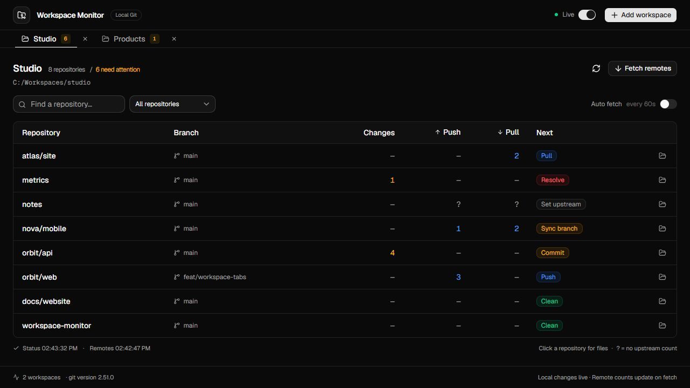
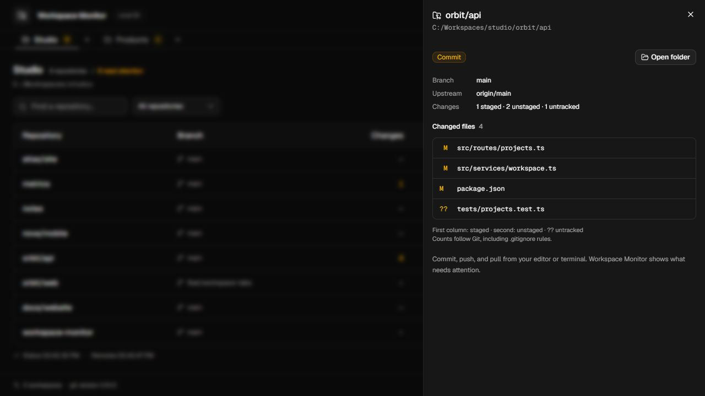
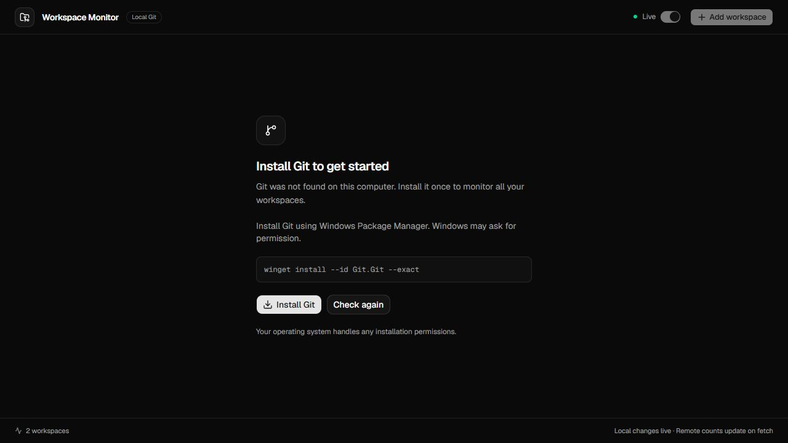

<div align="center">
  
  <h1>Workspace Monitor</h1>
  <p><strong>See what needs a commit, a push, or a pull — across all your workspaces.</strong></p>
  <p>A compact desktop Git monitor built with Tauri, React, and shadcn/ui.</p>
  <p>
    <a href="https://github.com/sajadjanat/workspace-monitor/actions/workflows/build.yml"></a>
    <a href="https://github.com/sajadjanat/workspace-monitor/releases"></a>
    
    
  </p>
  <p>
    <a href="#download">Download</a> ·
    <a href="#features">Features</a> ·
    <a href="#quick-start">Quick start</a> ·
    <a href="#development">Development</a>
  </p>
</div>



*The actual interface, shown with example workspaces. Screenshots contain no personal project data.*

## Why Workspace Monitor?

When your projects live in several folders, checking each repository takes time. Workspace Monitor gathers their Git status in one small table: local changes, commits ahead or behind, and the next step that needs your attention.

Keep several workspaces open as tabs. They all continue monitoring in the background, even when you are viewing another tab. The default **Needs attention** filter keeps the daily view short; **All repositories** includes clean projects.

## Features

| Feature | What it does |
| --- | --- |
| **Workspace tabs** | Add multiple folders, switch between them, and restore your tabs when the app reopens. |
| **Live local status** | File events trigger a debounced refresh, with a periodic scan to recover missed events. |
| **Clear next steps** | Colored labels identify Commit, Push, Pull, Resolve, Sync branch, and upstream problems. |
| **File details** | Open a side panel for changed paths, staged/unstaged counts, renames, and errors. |
| **Remote updates** | Fetch manually or opt into a fetch every 60 seconds for each workspace. |
| **Git onboarding** | Check Git at startup and offer an OS installer or the official download page if it is missing. |
| **Native folder access** | Choose workspaces with the system folder picker and open repositories in your file manager. |
| **Compact shadcn/ui interface** | Dark surfaces, readable type, keyboard-friendly controls, search, and status filtering. |

<details>
<summary><strong>Preview file details and Git setup</strong></summary>

### Changed files without clutter



### A clear first step when Git is missing



</details>

## Download

**Windows x64** installer and portable builds are available in [Releases](https://github.com/sajadjanat/workspace-monitor/releases/latest).

- **Installer:** run the `x64-setup.exe` file. It can provision WebView2 if the runtime is missing.
- **Portable:** extract the `windows-x64_portable.zip` file, then run `Workspace Monitor.exe`. Keep `WebView2Loader.dll` beside it.

You do not need Node.js or Rust to run the packaged app. Git is required for monitoring; the app helps you install it if necessary.

| Platform | Current availability |
| --- | --- |
| Windows x64 | Packaged and verified locally. |
| macOS | Build target in the CI workflow; no local runtime verification yet. |
| Linux | Build target in the CI workflow; no local runtime verification yet. |

The [desktop build workflow](https://github.com/sajadjanat/workspace-monitor/actions/workflows/build.yml) builds each platform on its own runner. Successful runs expose installers as downloadable artifacts. Release signing and macOS notarization are not configured yet.

## Quick start

1. Open Workspace Monitor. If Git is missing, select **Install Git** or **Download Git**, then **Check again**.
2. Select **Add workspace** and choose a folder containing your Git repositories. You can choose multiple folders at once.
3. Read the **Next** column. Click a repository to inspect its files or errors.
4. Select **Fetch remotes** for current upstream counts. Enable **Auto fetch** if you want those counts refreshed periodically.

### Read the table

| Column | Meaning |
| --- | --- |
| **Changes** | Changed Git entries, including staged, unstaged, and untracked paths. |
| **Push** | Commits ahead of the tracked upstream. |
| **Pull** | Commits behind the tracked upstream. |
| **Next** | The suggested action; your editor or terminal performs commits, pushes, and pulls. |
| **—** | Zero changes or zero commits. |
| **?** | No reliable upstream count is available. Inspect the repository details. |

Conflicts, detached HEAD, missing upstreams, and command failures remain visible. A failed fetch stays visible until a later fetch succeeds.

### Local and remote timing

- **Local changes:** refresh after 350 ms of file-event inactivity, plus a safety scan every 15 seconds.
- **Remote counts:** reflect local tracking refs until you fetch. Opt-in automatic fetch runs approximately every 60 seconds while Live is enabled.
- **Paused:** automatic monitoring stops; manual refresh and fetch remain available.

Fetch updates Git's remote refs. Workspace Monitor never commits, pushes, pulls, resets, or modifies your source files.

## Development

Install **Node.js 22+**, **Rust stable**, and the [Tauri prerequisites](https://tauri.app/start/prerequisites/) for your operating system. Install Git to run the real Git integration tests.

```sh
git clone https://github.com/sajadjanat/workspace-monitor.git
cd workspace-monitor
npm ci
npm run tauri dev
```

### Verify

```sh
npm test
npm run build
cargo test --locked --manifest-path src-tauri/Cargo.toml
```

The current suite includes **8 UI/monitoring tests** and **8 Git-engine tests**. It checks independent tabs, event debounce, scan concurrency, install success/failure, rename and conflict parsing, Unicode paths, ignore rules, and real Git divergence/fetch behavior.

### Package

```sh
npm run tauri build
```

Bundles appear in `src-tauri/target/release/bundle/`. Build an OS package on that OS, or use the included GitHub Actions workflow. To build only the Windows NSIS installer:

```sh
npm run tauri build -- --bundles nsis
```

### UI and documentation preview

`npm run dev` alone shows the desktop requirement screen: a regular browser cannot inspect local Git repositories.

To reproduce the documentation screenshots using sample data:

```sh
npm run docs:preview
npm run dev
# Open http://localhost:1420/.dev/readme-preview.html
# Git onboarding: append ?git=missing
```

This preview is a separate development page. The packaged app always reads real Git status.

For local Windows development, `scripts/local-toolchain.ps1` can activate a separately prepared portable Rust/LLVM toolchain without changing the system PATH. Standard Tauri prerequisites remain the default for a fresh checkout. [Contributor notes](docs/development.md) describe the diagnostic CLI and native smoke test.

## How it works

```text
React + shadcn/ui    →    Tauri commands    →    Rust scanner    →    system Git
       ↑                         ↑
  workspace tabs          native file events
```

The Rust scanner discovers repositories and reads `git status --porcelain=v2`. It understands worktree `.git` files and skips dependency/build folders during discovery. Git decides which source files are ignored.

| Location | Purpose |
| --- | --- |
| `src/App.tsx` | Workspace tabs, the status table, onboarding, and file details. |
| `src/components/ui/` | Actual shadcn/ui source components. |
| `src/lib/use-monitor.ts` | Debounced refresh, background scheduling, and bounded concurrency. |
| `src-tauri/src/git.rs` | Repository discovery, Git commands, and status parsing. |
| `src-tauri/src/install.rs` | OS-specific Git detection and installation. |
| `src-tauri/src/lib.rs` | Native commands, workspace persistence, and file watchers. |

## Useful notes

**Why are `.idea` files still listed?** Git ignores only untracked files. If those files are already tracked, add the ignore rule and untrack them in your repository. Workspace Monitor follows Git's result.

**Why does an untracked folder count as one change?** Counts follow Git's `--untracked-files=normal` mode. Staged and unstaged counts may overlap when the same file has both kinds of edits.

**What if fetch fails?** Authenticate or resolve remote access in your terminal, then retry. Existing Git configuration and credentials are used; this app does not store credentials or prompt for them during background scans.

**Where are tabs saved?** In `workspaces.json` under the OS app configuration directory for `ir.sepehra.workspace-monitor`. Closing a tab stops monitoring it without deleting its folder.

**How does Git installation work?** The button uses Windows Package Manager, Homebrew/Apple developer tools, or a supported Linux package manager through `pkexec`. The OS handles any permission prompts. If no supported installer is available, the app opens the official Git download page. Installation starts only after a click.

## Contributing

[Report a bug or propose a feature](https://github.com/sajadjanat/workspace-monitor/issues). For code changes, describe the problem, keep the compact interface in mind, and run the relevant checks before opening a pull request. UI copy stays in English.

---

Built by [Sajad Janat](https://github.com/sajadjanat). UI built with [shadcn/ui](https://ui.shadcn.com/), desktop runtime powered by [Tauri](https://tauri.app/).
