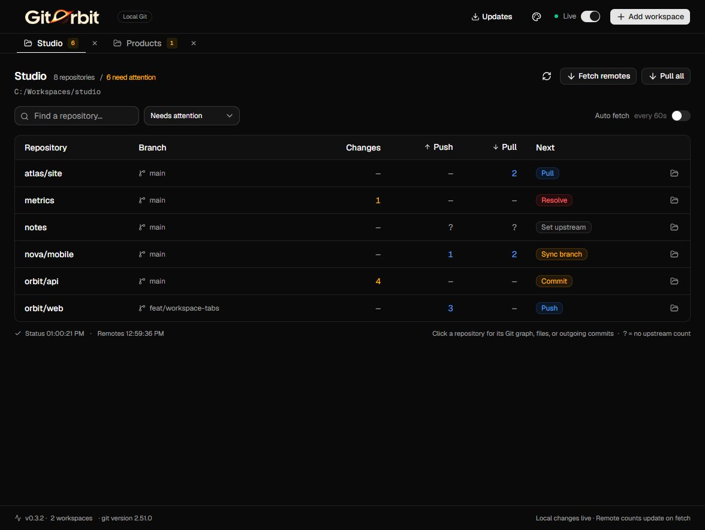
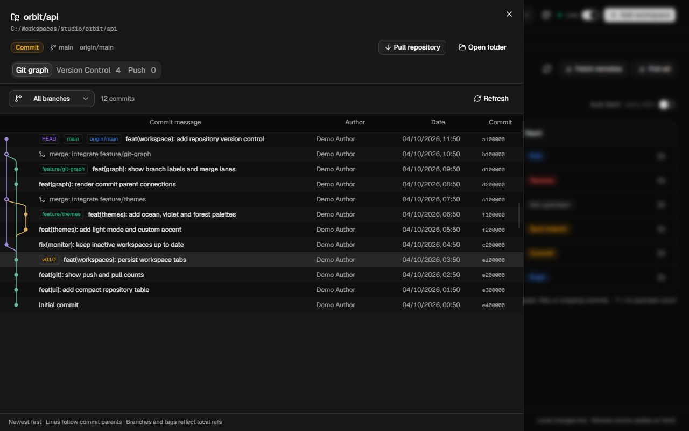
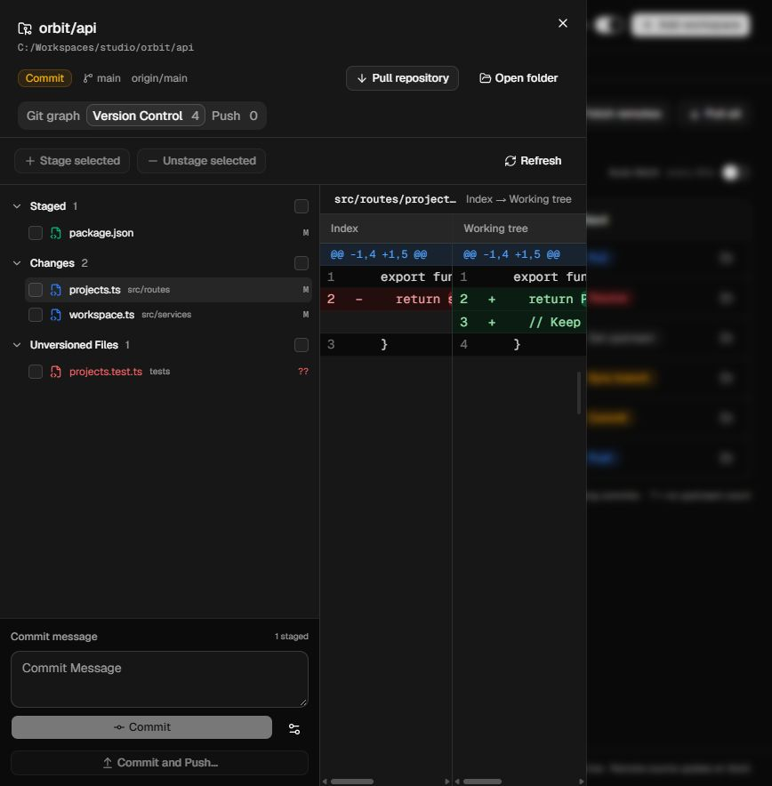
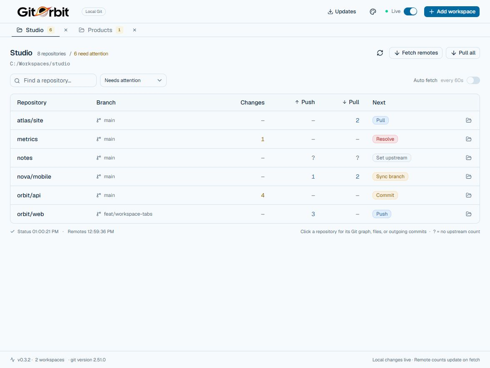
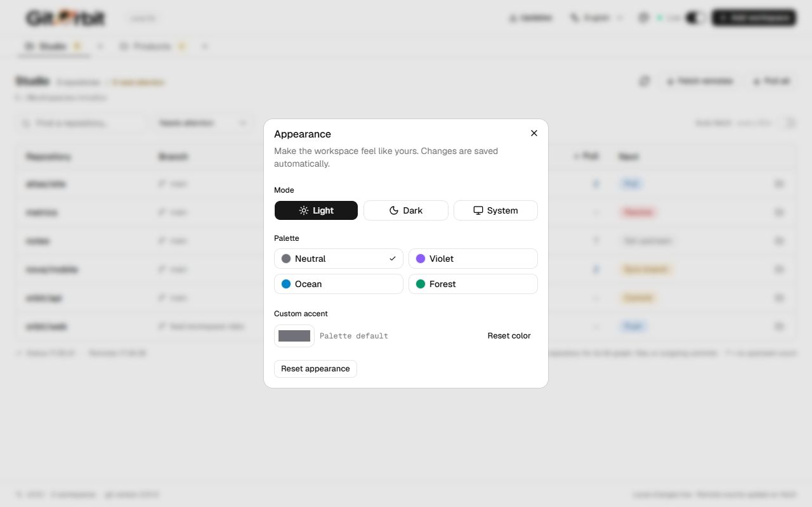
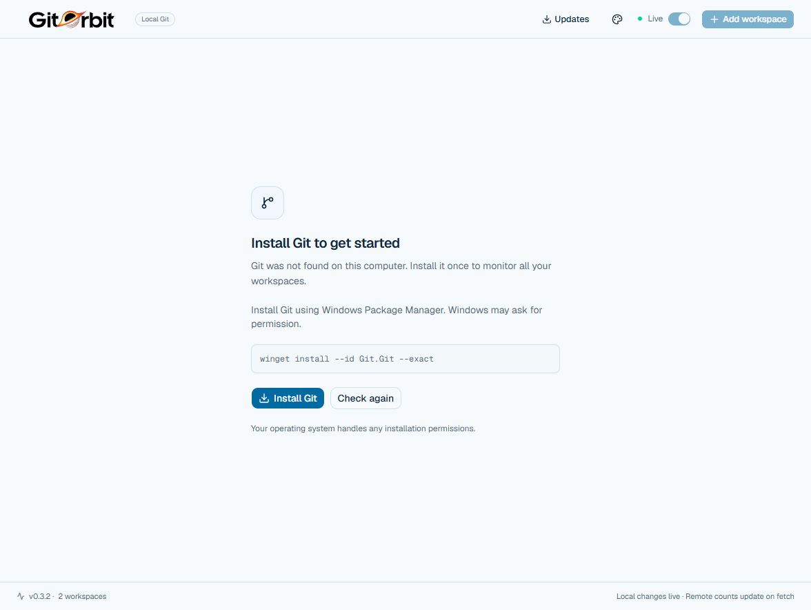
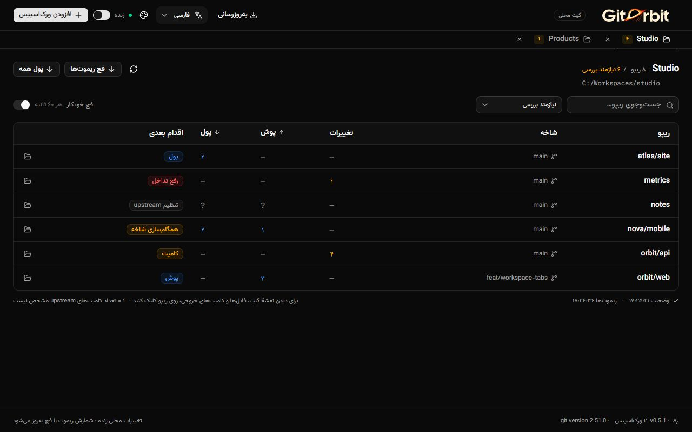
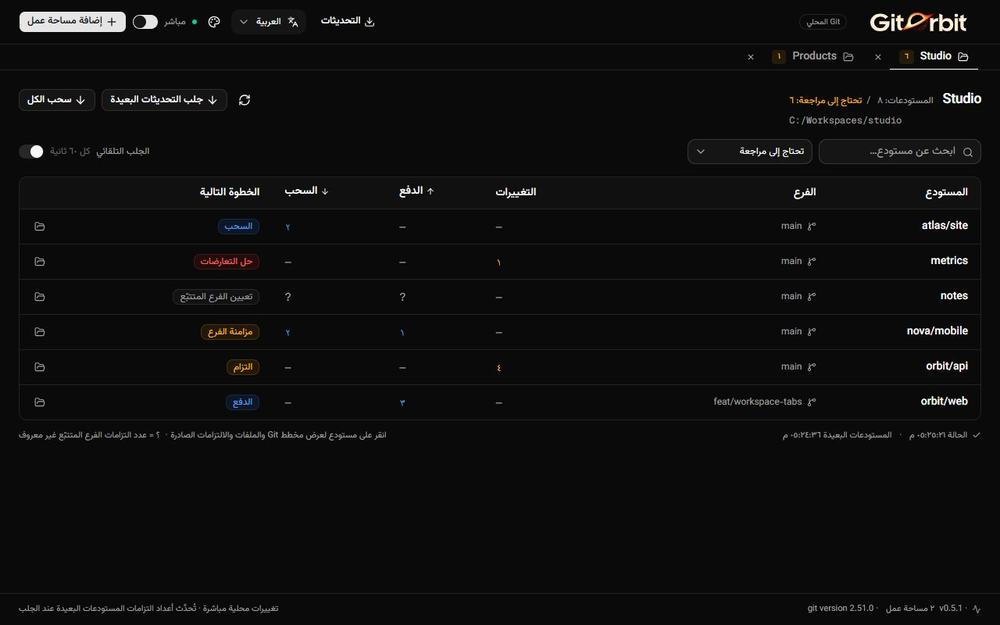
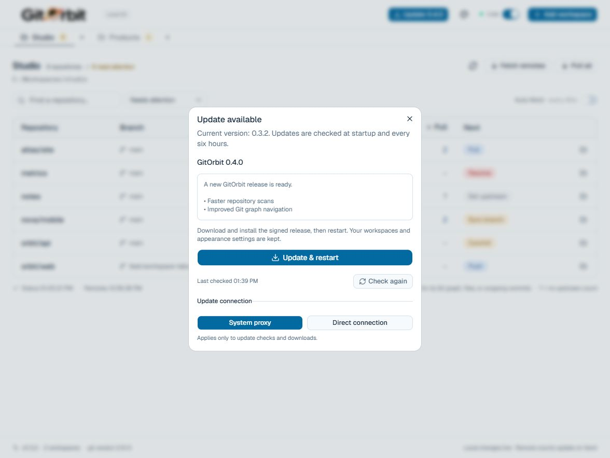

<p align="center"><strong>English</strong> · <a href="README.fa.md">فارسی</a> · <a href="README.ar.md">العربية</a> · <a href="README.zh-CN.md">简体中文</a></p>

<div align="center">
  
  <h1>GitOrbit</h1>
  <p><strong>See what needs a commit, a push, or a pull — across all your workspaces.</strong></p>
  <p>A compact desktop Git monitor built with Tauri, React, and shadcn/ui.</p>
  <p>
    <a href="https://github.com/sajadjanat/gitorbit/actions/workflows/build.yml"></a>
    <a href="https://github.com/sajadjanat/gitorbit/releases"></a>
    
    
  </p>
  <p>
    <a href="#download">Download</a> ·
    <a href="#features">Features</a> ·
    <a href="#quick-start">Quick start</a> ·
    <a href="#development">Development</a>
  </p>
</div>



*The current GitOrbit interface, captured with example workspaces. The screenshots show the updated header logotype and contain no personal project data.*

## Why GitOrbit?

When your projects live in several folders, checking each repository takes time. GitOrbit gathers their Git status in one small table: local changes, commits ahead or behind, and the next step that needs your attention.

Keep several workspaces open as tabs. They all continue monitoring in the background, even when you are viewing another tab. The default **Needs attention** filter keeps the daily view short; **All repositories** includes clean projects.

## Features

| Feature | What it does |
| --- | --- |
| **Workspace tabs** | Add multiple folders, switch between them, and restore your tabs when the app reopens. |
| **Live local status** | File events trigger a debounced refresh, with a periodic scan to recover missed events. |
| **Clear next steps** | Colored labels identify Commit, Push, Pull, Resolve, Sync branch, and upstream problems. |
| **Git graph** | Click a repository to see real commit history, branch lanes, merges, HEAD, branches, and tags. |
| **Version Control** | Inspect staged, unstaged, and unversioned files; review diffs, stage a selection, unstage, and commit. |
| **Push preview** | Review outgoing commits, open any file in a synchronized side-by-side diff, then push explicitly. |
| **Pull one or all** | Fast-forward one repository or every repository in the active workspace, with individual results. |
| **Your appearance** | Light, dark, or system mode; Neutral, Violet, Ocean, and Forest palettes; a custom accent color. |
| **Four languages** | English, Persian, Arabic, and Simplified Chinese, with saved language preferences and RTL/LTR layouts. |
| **In-app updates** | Automatically check for signed releases, show release notes, and install with **Update & restart**. |
| **Remote updates** | Fetch manually or opt into a fetch every 60 seconds for each workspace. |
| **Git onboarding** | Check Git at startup and offer an OS installer or the official download page if it is missing. |
| **Native folder access** | Choose workspaces with the system folder picker and open repositories in your file manager. |
| **Compact shadcn/ui interface** | Readable type, keyboard-friendly controls, search, and status filtering. |

<details>
<summary><strong>Explore the graph, Version Control, and themes</strong></summary>

### Follow branches and merges



### Review, stage, and commit



### A lighter workspace





### A clear first step when Git is missing



</details>

<details>
<summary><strong>Localized previews · فارسی · العربية · 简体中文</strong></summary>

### فارسی

[Read the Persian README](README.fa.md)



### العربية

[Read the Arabic README](README.ar.md)



### 简体中文

[Read the Chinese README](README.zh-CN.md)


</details>

## Download

Download **GitOrbit for Windows, macOS or Linux** from [Releases](https://github.com/sajadjanat/gitorbit/releases/latest).

- **Installer:** run the `x64-setup.exe` file. It can provision WebView2 if the runtime is missing.
- **Portable:** extract the portable ZIP and run the included app executable. Earlier releases use `Workspace Monitor.exe`; GitOrbit packages use the new branding. Keep `WebView2Loader.dll` beside the executable.
- **macOS:** open the universal DMG and copy GitOrbit to Applications. The same package supports Intel and Apple Silicon.
- **Linux:** use the AppImage or install the DEB with your package manager. The DEB replaces the former `workspace-monitor` package during an upgrade.

You do not need Node.js or Rust to run the packaged app. Git is required for monitoring; the app helps you install it if necessary.

| Platform | Current availability |
| --- | --- |
| Windows x64 | NSIS installer and portable ZIP; legacy installation migration verified. |
| macOS | Universal DMG and signed app update archive. |
| Linux x64 | AppImage and DEB; replacement of the legacy DEB verified. |

The [desktop build workflow](https://github.com/sajadjanat/gitorbit/actions/workflows/build.yml) builds each platform on its own runner. Successful runs expose installers as downloadable artifacts. The [signed release workflow](https://github.com/sajadjanat/gitorbit/actions/workflows/release.yml) signs packages for in-app updates. Operating-system code signing and macOS notarization are not configured yet.

## Quick start

1. Open GitOrbit. If Git is missing, select **Install Git** or **Download Git**, then **Check again**.
2. Select **Add workspace** and choose a folder containing your Git repositories. You can choose multiple folders at once.
3. Read the **Next** column. Click a repository for its **Git graph**; switch to **Version Control** for files, diffs, and commits.
4. Select **Fetch remotes** for current upstream counts. Enable **Auto fetch** if you want those counts refreshed periodically.
5. Select **Pull all** to update the active workspace, or **Pull repository** in a repository's dialog. Review the updated, skipped, and failed results.
6. Open **Appearance** in the header to choose your mode, palette, and accent.

### Read the table

| Column | Meaning |
| --- | --- |
| **Changes** | Changed Git entries, including staged, unstaged, and untracked paths. |
| **Push** | Commits ahead of the tracked upstream. |
| **Pull** | Commits behind the tracked upstream. |
| **Next** | The suggested action. Open any row for details; stage, commit, pull, and review or push outgoing commits in the app. |
| **—** | Zero changes or zero commits. |
| **?** | No reliable upstream count is available. Inspect the repository details. |

Conflicts, detached HEAD, missing upstreams, and command failures remain visible. A failed fetch stays visible until a later fetch succeeds.

### Local and remote timing

- **Local changes:** refresh after 750 ms of file-event inactivity, at most once every 3 seconds, plus a safety scan every 60 seconds.
- **Remote counts:** reflect local tracking refs until you fetch. Opt-in automatic fetch runs approximately every 60 seconds while Live is enabled.
- **Paused:** automatic monitoring stops; manual refresh and fetch remain available.

Fetch updates Git's remote refs. Stage, unstage, commit, pull, and push happen only after an explicit click. Before pushing, review the outgoing commits and changed file names in the repository's **Push** tab. The app never pushes automatically or force-pushes.

### Version Control

Files are grouped into **Staged**, **Changes**, and **Unversioned Files**, with individual untracked files shown even inside new folders. A partially staged file appears in both Staged and Changes. Click either entry to review the corresponding **HEAD → Index** or **Index → Working tree** diff.

Select checkboxes, then choose **Stage selected** or **Unstage selected**. Enter a commit message and select **Commit** to commit the current index; unchecked unstaged files are not added automatically. Existing Git hooks and signing settings still apply. Refresh reloads the file list, and operation errors remain visible.

### Pull updates

**Pull all** includes every repository in the active workspace, including clean repositories hidden by search or the attention filter. It processes repositories in sequence and shows individual results; one failure does not stop the remaining repositories.

Pull uses `git pull --ff-only --no-rebase --no-edit`. Repositories with local changes (including untracked files), detached HEAD, or no upstream are skipped. Divergent history fails without merging or rebasing. Local files are never automatically stashed, discarded, or force-reset. Resolve the reported issue and retry. Git uses your existing remote credentials.

### Push commits

Open a repository and select its **Push** tab to review outgoing commits and the files changed by the selected commit. Click a file to compare the commit with its first parent in a synchronized side-by-side diff. The file list moves into the sidebar; close the diff to return to the outgoing commits. **Push** sends the previewed branch tip to the tracked remote branch; local uncommitted changes are not included. If the branch changes after the preview, refresh the list before pushing. A remote branch that is ahead must be fetched and pulled first.

### Git sign-in

If a push fails because authentication is missing or expired, GitOrbit shows **Sign in to Git** and the remote host. Complete the Git Credential Manager dialog, then choose **Retry push**. Sign-in checks access with a dry run; it does not send your commits. You can cancel, and sign-in times out after three minutes. If the credential manager is missing, **Set up Git sign-in** opens the [official installation guide](https://github.com/git-ecosystem/git-credential-manager/blob/main/docs/install.md); install and configure it, then recheck. Use an access token when your server requires one. SSH remotes need an SSH key configured outside the app. GitOrbit does not collect passwords, and background scans never open login dialogs.

### Git history

The graph follows actual commit parents in topological order, including merge connections and local branch, remote, and tag labels. Choose **All branches** or **Current HEAD**. History starts with 200 commits; load more in batches up to 5,000. Shallow clones show only locally available history. Fetch first to update remote branch labels.

## App updates

Starting with **0.3.0**, the app checks for new releases at startup and every six hours while running. Select **Updates** in the header to check manually. When a newer release is available, the button shows its version; open it to review the notes and choose **Update & restart**. Download progress and errors are shown. Installation waits for active Git operations to finish and preserves saved workspaces and appearance settings.

Only packages signed with the configured release key are accepted. The signature also binds the advertised version to the package, and older versions are not offered. Checks use the public `latest.json` asset on the latest GitHub release. The signed release workflow publishes installers, signatures, and that manifest.

**Workspace Monitor is now GitOrbit.** Versions **0.3.0–0.3.2** can upgrade directly from **Updates → Update & restart**. The original update URL redirects to the GitOrbit repository, and the signing key and application identifier remain the same. Saved workspaces and appearance settings are preserved. Windows upgrades reuse verified legacy installations and update existing shortcuts and icons. Keep the former `sajadjanat/workspace-monitor` repository name available for GitHub's redirect; reusing it would break old clients' update URL.

Users of **0.1.0 or 0.2.0 must install the latest GitOrbit release once manually** to enable future in-app updates. On Windows, the updater uses the NSIS installer; a portable installation is upgraded to the normal per-user installation. Linux updates use the AppImage, and macOS uses the application bundle. Releases are published after signed update packages for all three operating systems are ready.

**Update connection** defaults to your system proxy settings. If a configured proxy prevents checks or downloads, select **Direct connection** to use direct HTTPS for updates. The choice is saved separately from workspace and appearance preferences. Switching mode clears the previous result and checks again; downloads use the connection that found the release.



*The update screenshot uses example release metadata to demonstrate the update flow.*

## Development

Install **Node.js 22+**, **Rust stable**, and the [Tauri prerequisites](https://tauri.app/start/prerequisites/) for your operating system. Install Git to run the real Git integration tests.

```sh
git clone https://github.com/sajadjanat/gitorbit.git
cd gitorbit
npm ci
npm run tauri dev
```

### Verify

```sh
npm test
npm run build
cargo test --locked --manifest-path src-tauri/Cargo.toml
```

The suite covers independent tabs, event debounce, scan concurrency, onboarding, theme persistence, graph topology and pagination, stale history requests, selected staging and commits, bulk pull coverage, Unicode and literal paths, renames, conflicts, and real fast-forward/divergent pull behavior. A native smoke test also exercises the real desktop graph and file diff.

### Package

```sh
npm run tauri build
```

Bundles appear in `src-tauri/target/release/bundle/`. Build an OS package on that OS, or use the included GitHub Actions workflow. To build only the Windows NSIS installer:

```sh
npm run tauri build -- --bundles nsis
```

### UI and documentation preview

`npm run dev` alone shows the desktop requirement screen: a regular browser cannot inspect local Git repositories.

To reproduce the documentation screenshots using sample data:

```sh
npm run docs:preview
npm run dev
# Open http://localhost:1420/.dev/readme-preview.html
# Git onboarding: append ?git=missing
```

This preview is a separate development page. The packaged app always reads real Git status.

For local Windows development, `scripts/local-toolchain.ps1` can activate a separately prepared portable Rust/LLVM toolchain without changing the system PATH. Standard Tauri prerequisites remain the default for a fresh checkout. [Contributor notes](docs/development.md) describe the diagnostic CLI and native smoke test.

## How it works

```text
React + shadcn/ui    →    Tauri commands    →    Rust scanner    →    system Git
       ↑                         ↑
  workspace tabs          native file events
```

The Rust scanner discovers repositories and reads `git status --porcelain=v2`. It understands worktree `.git` files and skips dependency/build folders during discovery. Git decides which source files are ignored.

| Location | Purpose |
| --- | --- |
| `src/App.tsx` | Workspace tabs, the status table, repository dialogs, and pull results. |
| `src/components/repository-history.tsx` | Interactive commit history and branch labels. |
| `src/lib/git-graph.ts` | Commit parent connections and colored lane layout. |
| `src/components/version-control.tsx` | File selection, staging, diffs, and commits. |
| `src/components/appearance.tsx` | Saved modes, palettes, and custom accents. |
| `src/components/ui/` | Actual shadcn/ui source components. |
| `src/lib/use-monitor.ts` | Debounced refresh, background scheduling, and bounded concurrency. |
| `src-tauri/src/git.rs` | Repository discovery, Git commands, and status parsing. |
| `src-tauri/src/history.rs` | Real history and refs from system Git. |
| `src-tauri/src/version_control.rs` | Validated file operations, diffs, commits, and fast-forward pulls. |
| `src-tauri/src/install.rs` | OS-specific Git detection and installation. |
| `src-tauri/src/lib.rs` | Native commands, workspace persistence, and file watchers. |

## Useful notes

**Why are `.idea` files still listed?** Git ignores only untracked files. If those files are already tracked, add the ignore rule and untrack them in your repository. GitOrbit follows Git's result.

**Why does an untracked folder count as one change?** Overview counts follow Git's `--untracked-files=normal` mode. Version Control expands untracked folders into individual files. Staged and unstaged counts may overlap when the same file has both kinds of edits.

**What if fetch fails?** Authenticate or resolve remote access in your terminal, then retry. Existing Git configuration and credentials are used; this app does not store credentials or prompt for them during background scans.

**Where are tabs saved?** In `workspaces.json` under the OS app configuration directory for `ir.sepehra.workspace-monitor`. Closing a tab stops monitoring it without deleting its folder.

**Which languages are supported?** English, Persian (فارسی), Arabic (العربية), and Simplified Chinese (简体中文). Choose a language in the header; it changes immediately and survives restarts. Persian and Arabic mirror the layout, tabs, dialogs, and Git graph; English and Chinese use LTR. File paths, hashes, and code diffs keep their original direction. Switching languages preserves open workspaces, selected files, and draft commit messages. [Persian](README.fa.md), [Arabic](README.ar.md), and [Chinese](README.zh-CN.md) READMEs include screenshots in their own language.

**Where are themes saved?** In the app's local storage. System mode follows OS appearance changes; palette and accent settings survive restarts.

**How does Git installation work?** The button uses Windows Package Manager, Homebrew/Apple developer tools, or a supported Linux package manager through `pkexec`. The OS handles any permission prompts. If no supported installer is available, the app opens the official Git download page. Installation starts only after a click.

## Contributing

[Report a bug or propose a feature](https://github.com/sajadjanat/gitorbit/issues). For code changes, describe the problem, keep the compact interface in mind, and run the relevant checks before opening a pull request. Add UI translations for English, Persian, Arabic, and Chinese in `src/lib/messages.ts`, with matching interpolation fields. Keep the localized READMEs and their screenshots consistent with the interface.

---

Built by [Sajad Janat](https://github.com/sajadjanat). UI built with [shadcn/ui](https://ui.shadcn.com/), desktop runtime powered by [Tauri](https://tauri.app/).
