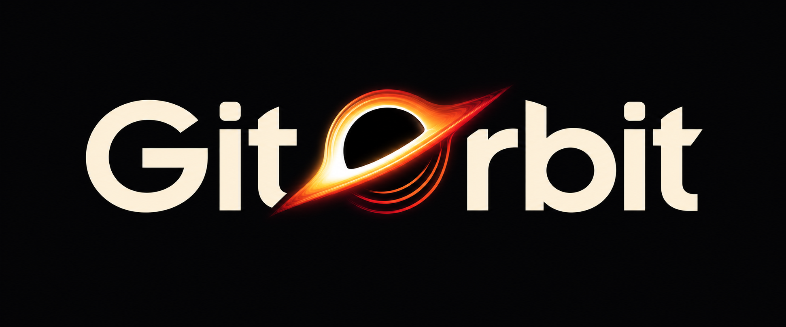
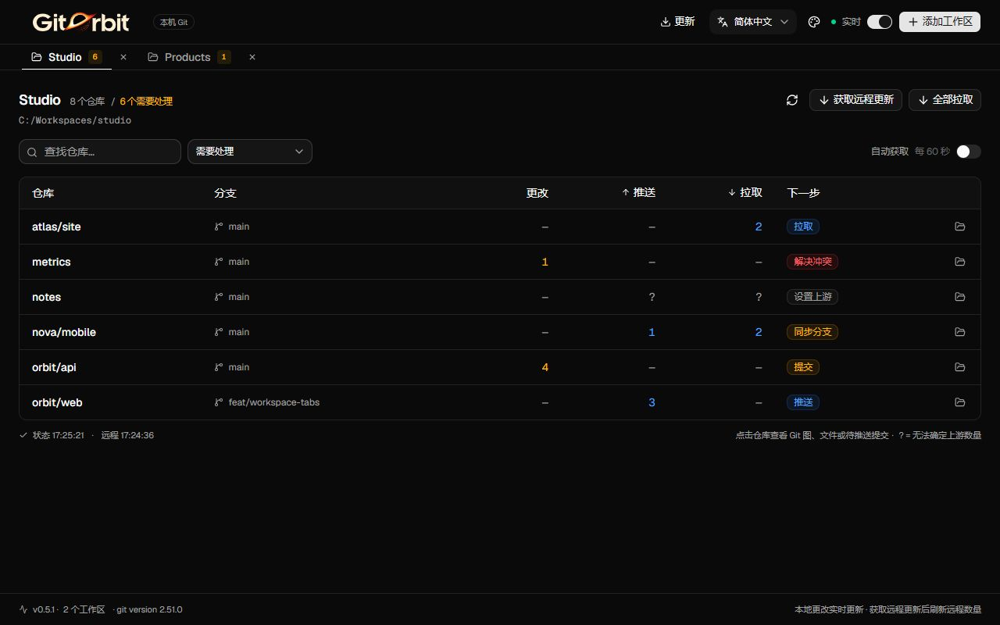
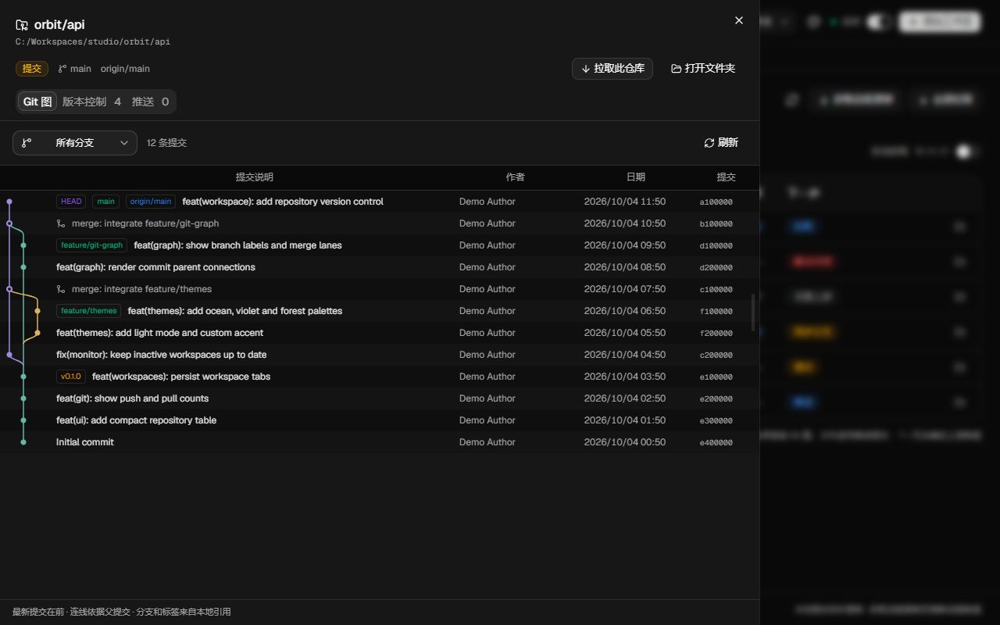
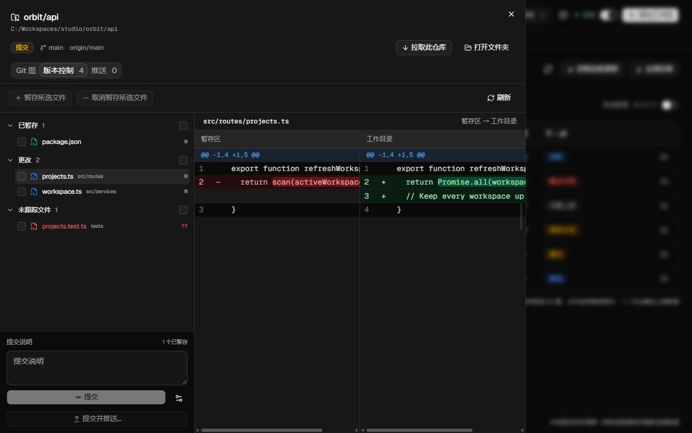
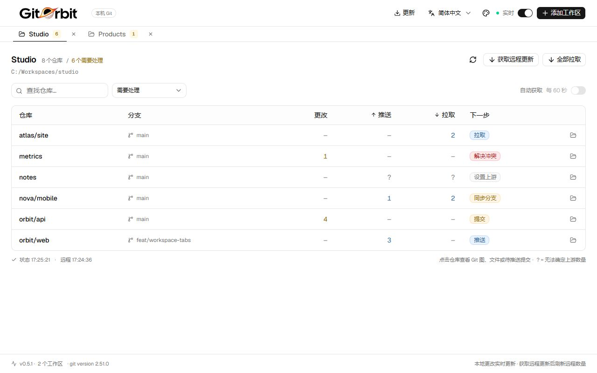
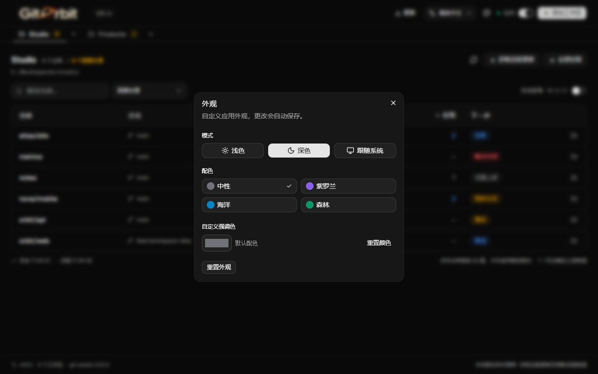

<p align="center"><a href="README.md">English</a> · <a href="README.fa.md">فارسی</a> · <a href="README.ar.md">العربية</a> · <strong>简体中文</strong></p>

<div align="center">
  
  <h1>GitOrbit</h1>
  <p><strong>一眼看清所有工作区中哪些项目需要提交、推送或拉取。</strong></p>
  <p>使用 Tauri、React 和 shadcn/ui 构建的轻量桌面 Git 监控工具。</p>
  <p><a href="https://github.com/sajadjanat/gitorbit/releases/latest">下载最新版本</a> · <a href="https://github.com/sajadjanat/gitorbit/issues">反馈问题或建议</a></p>
</div>



*截图来自真实应用界面，使用示例工作区。仓库名、路径、代码和示例 Git 提交说明保持原始内容。*

## 为什么选择 GitOrbit？

项目分散在多个文件夹时，逐个检查 Git 状态很费时间。GitOrbit 将本地更改、领先或落后的提交数量，以及需要处理的下一步汇总到一个小表格中。

可以将多个工作区作为标签页打开。即使切换到其他标签页，所有工作区仍在后台监控。默认的“需要处理”筛选让日常视图更简洁，“所有仓库”也会显示没有更改的项目。

## 功能

| 功能 | 说明 |
| --- | --- |
| 工作区标签页 | 添加多个文件夹、随时切换，并在重启应用后恢复标签页。 |
| 本地实时状态 | 文件事件触发防抖刷新，并通过定期扫描补足遗漏的事件。 |
| 清晰的下一步 | 彩色标签标明提交、推送、拉取、解决冲突、同步分支或设置上游。 |
| Git 图 | 查看真实提交历史、分支连线、合并、HEAD、分支和标签。 |
| 版本控制 | 查看已暂存、更改和未跟踪文件，比较差异、暂存、取消暂存并提交。 |
| 推送预览 | 检查待推送提交，并用同步滚动的双栏差异视图查看文件，再明确执行推送。 |
| 拉取单个或全部仓库 | 仅快进更新当前仓库或整个工作区，并显示每个仓库的结果。 |
| 自定义外观 | 浅色、深色或跟随系统；中性、紫罗兰、海洋和森林配色，以及自定义强调色。 |
| 四种语言 | 英语、波斯语、阿拉伯语和简体中文；保存语言选择并支持 RTL/LTR。 |
| 应用内更新 | 自动检查经过签名的版本，查看说明并通过“更新并重启”安装。 |
| Git 安装引导 | 启动时检查 Git，缺失时提供系统安装程序或官方下载页面。 |

## 界面预览

### 分支与合并



### 文件、差异与提交



### 浅色模式与外观设置





## 下载与安装

从[最新发行版](https://github.com/sajadjanat/gitorbit/releases/latest)选择适合系统的安装包：

| 系统 | 安装包 |
| --- | --- |
| Windows x64 | `x64-setup.exe` 安装程序或便携 ZIP。便携版请完整解压，并将 `WebView2Loader.dll` 放在可执行文件旁。 |
| macOS | 支持 Intel 和 Apple Silicon 的通用 DMG；将 GitOrbit 复制到 Applications。 |
| Linux x64 | AppImage 或 DEB；升级时 DEB 会替换旧的 `workspace-monitor` 软件包。 |

运行已打包的应用不需要 Node.js 或 Rust。监控需要 Git，应用会协助安装。Windows 安装程序可以在缺少 WebView2 时安装它。更新包签名已启用；操作系统代码签名和 macOS 公证尚未配置。

## 快速开始

1. 打开 GitOrbit。如果缺少 Git，选择“安装 Git”或“下载 Git”，完成后点击“重新检查”。
2. 在顶部语言菜单选择“简体中文”。选择会保存；切换语言不会丢失工作区、所选文件或提交说明草稿。
3. 点击“添加工作区”，选择包含 Git 仓库的文件夹。可以一次选择多个文件夹。
4. 查看“下一步”列。点击仓库先打开“版本控制”，再切换到“推送”或最后的“Git 图”标签页。
5. 点击“获取远程更新”刷新上游数量，也可启用“自动获取”。
6. 使用“全部拉取”或“拉取此仓库”更新项目并检查结果；在“外观”中选择模式和颜色。

| 列 | 含义 |
| --- | --- |
| 更改 | Git 中的更改项，包括已暂存、未暂存和未跟踪路径。 |
| 推送 | 领先于跟踪上游的提交数量。 |
| 拉取 | 落后于跟踪上游的提交数量。 |
| — | 零更改或零提交。 |
| ? | 无法获得可靠的上游数量，请检查仓库详情。 |

## 文件与 Git 操作

部分暂存的文件会同时出现在“已暂存”和“更改”中。点击对应条目，查看 HEAD 与暂存区、或暂存区与工作目录之间的差异。勾选文件后点击“暂存所选文件”或“取消暂存所选文件”。提交只记录当前暂存区，未暂存的文件不会自动加入。已有 Git 钩子和签名设置仍然生效。

“全部拉取”包含被搜索或筛选隐藏的仓库，按顺序处理并给出各自的结果。使用的命令是 `git pull --ff-only --no-rebase --no-edit`。有本地更改、分离的 HEAD 或未设置上游的仓库会跳过；分叉历史会报错，不会自动合并或变基。应用不会自动储藏、删除或强制重置本地文件，也不会强制推送。

推送前在“推送”标签页检查提交和更改文件。应用将预览的分支提交发送到跟踪的远程分支，本地未提交的更改不会包含在内。预览后分支发生变化时，请先刷新列表；远程领先时应先获取并拉取。

点击文件即可用双栏视图比较所选提交及其第一个父提交。文件列表会移到提交列表的位置；关闭差异视图即可返回待推送提交列表。两栏同步滚动，本地未提交的更改不会影响这项比较。

Git 图依据真实父提交绘制。初次加载 200 条历史，可继续加载至 5,000 条；浅克隆只显示本地可用历史。路径、哈希和代码保持独立方向，切换 RTL 语言也不会改变差异面板的前后顺序。提交日期使用本地格式和公历。

本地文件事件静默 750 毫秒后刷新，最多每 3 秒一次，并每 60 秒进行补充扫描。可选的自动获取约每 60 秒运行一次。暂停实时监控后，仍可手动刷新和获取。

## 更新与设置

从 0.3.0 起，应用启动时和运行期间每六小时检查新版本。也可点击顶部“更新”手动检查。更新仅接受使用原始密钥签名的包，等待当前 Git 操作完成，并保留工作区与外观设置。如果系统代理阻止下载，可在“更新连接”中选择“直连”。

Workspace Monitor 现已更名为 GitOrbit。0.3.0–0.3.2 可以在应用内直接升级；0.1.0 和 0.2.0 需要手动安装一次最新版本。Windows 便携版通过更新会转为当前用户的常规安装。

工作区保存在 `ir.sepehra.workspace-monitor` 应用配置目录下的 `workspaces.json` 中。语言和外观保存在应用本地存储中。关闭标签页不会删除项目文件夹。忽略规则由 Git 决定；已经被跟踪的 `.idea` 文件不会因加入 `.gitignore` 而自动取消跟踪。

## 开发与贡献

安装 Node.js 22 或更高版本、Rust stable、Git 和适用于系统的 [Tauri 前置依赖](https://tauri.app/start/prerequisites/)。

```sh
git clone https://github.com/sajadjanat/gitorbit.git
cd gitorbit
npm ci
npm run tauri dev

# Checks
npm test
npm run build
cargo test --locked --manifest-path src-tauri/Cargo.toml

# Package
npm run tauri build
```

运行 `npm run docs:preview` 和 `npm run dev` 后，打开 `http://localhost:1420/.dev/readme-preview.html?lang=zh` 查看示例界面。该页面仅用于文档预览；已安装的应用始终读取真实 Git 状态。

详细架构、测试和发行流程见[开发说明](docs/development.md)及[英文 README](README.md)。新增界面文本时，请在 `src/lib/messages.ts` 中补全所有语言并保留一致的插值字段。[反馈问题或提出建议](https://github.com/sajadjanat/gitorbit/issues)。

由 [Sajad Janat](https://github.com/sajadjanat) 开发，界面使用 [shadcn/ui](https://ui.shadcn.com/)，桌面运行时使用 [Tauri](https://tauri.app/)。

